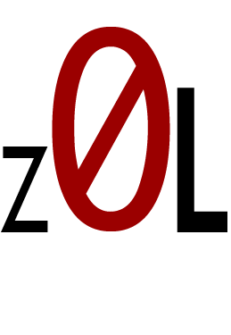

  

# z0L-security-portfolio

Welcome! This repository serves as a comprehensive collection showcasing my expertise in smart contract security audits.
## Overview

Smart contract security is crucial in blockchain development. By thoroughly reviewing code and identifying vulnerabilities, I ensure the robustness of decentralized applications and protocols. This repository aims to:

- Document existing audit reports.
- Provide summaries and insights into findings and security best practices.
- Demonstrate my comprehensive approach to smart contract security.
